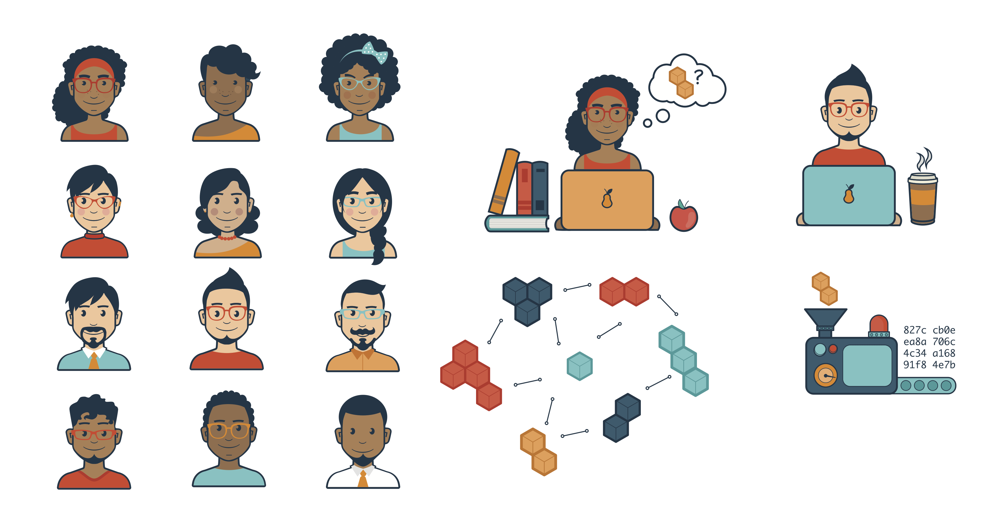

These Characters/Personas and Illustrations created by Agata Krych http://agata.krych.eu/ (@agata on github) for the presentation [Storing Data Together: How the distributed web could bring a new Golden Age for Libraries](http://2017.code4lib.org/talks/How-the-distributed-web-could-bring-a-new-Golden-Age-for-Libraries) at [Code4Lib 2017](http://2017.code4lib.org/). [[Slides](Golden_Age_for_Libraries_illustrations.pdf)][[Video](https://youtu.be/xRuPShYelm4?t=3h7m40s)]

A sample of the illustrations:

[Full PDF Preview of all the vector artwork](Golden_Age_for_Libraries_illustrations.pdf)

These works are licensed under a [Creative Commons Attribution-ShareAlike 4.0 International License](http://creativecommons.org/licenses/by-sa/4.0/).

Copyright 2017 Protocol Labs.
